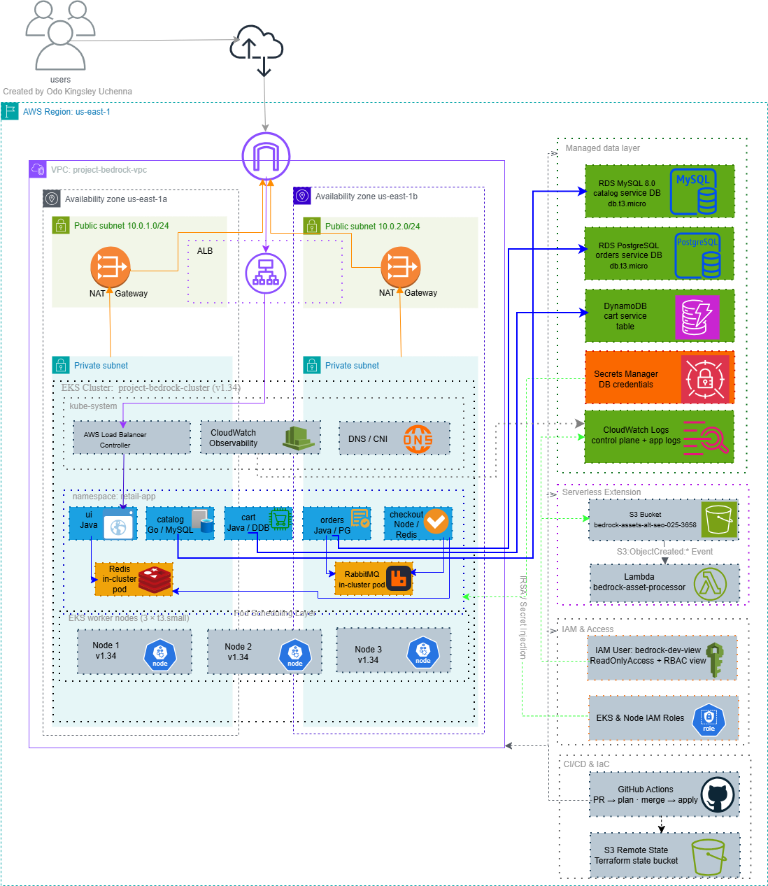

# Project Bedrock Capstone Documentation

This document explains the capstone work added to this repository. The root `README.md` is the original AWS Retail Store Sample App documentation. This file focuses on the Project Bedrock deployment work.

## Project Summary

Project Bedrock deploys the AWS Retail Store Sample App on Amazon EKS in `us-east-1`.

The infrastructure is written with Terraform and lives in `infrastructure/terraform`. The application is deployed to Kubernetes with Helm releases managed by Terraform. The deployment also includes managed database services, developer read-only access, CloudWatch logging, an S3 asset bucket, and a Lambda function that reacts to uploaded files.

## Required Standards Used

| Requirement | Value in this repository |
| --- | --- |
| AWS Region | `us-east-1` |
| EKS Cluster Name | `project-bedrock-cluster` |
| VPC Name Tag | `project-bedrock-vpc` |
| Application Namespace | `retail-app` |
| Developer IAM User | `bedrock-dev-view` |
| S3 Assets Bucket | `bedrock-assets-alt-soe-025-3658` |
| Lambda Function | `bedrock-asset-processor` |
| Required AWS Tag | `Project = karatu-2025-capstone` |

The required AWS tag is configured in the AWS provider default tags in `infrastructure/terraform/providers.tf`. The ALB created by the AWS Load Balancer Controller is tagged through the ingress annotation in `infrastructure/terraform/main.tf`.

## Repository Areas

| Path | Purpose |
| --- | --- |
| `infrastructure/terraform` | Main Terraform root for the capstone infrastructure |
| `infrastructure/terraform/modules/vpc` | VPC, public subnets, private subnets, NAT gateway, route tables |
| `infrastructure/terraform/modules/eks` | EKS cluster, node group, CloudWatch add-on, ALB controller IAM role |
| `infrastructure/terraform/modules/rds` | MySQL and PostgreSQL RDS instances and database secrets |
| `infrastructure/terraform/modules/dynamodb` | DynamoDB table used by the cart service |
| `infrastructure/terraform/modules/iam` | Developer IAM user, access key, console profile, and policies |
| `infrastructure/terraform/modules/s3-lambda` | S3 assets bucket, Lambda function, and S3 event trigger |
| `infrastructure/helm` | Helm values and notes for the retail app deployment |
| `infrastructure/k8s/retail-app` | Kubernetes ingress manifest for the retail app |
| `.github/workflows/terraform.yml` | CI/CD workflow for Terraform plan and apply |
| `grading.json` | Terraform output JSON committed at the repository root for grading |

## Infrastructure Overview

Terraform creates a new VPC with public and private subnets across two Availability Zones. The public subnets are used for internet-facing load balancer support. The private subnets are used for EKS worker nodes and RDS databases.

The EKS cluster is named `project-bedrock-cluster`. It uses managed worker nodes and has EKS control plane logging enabled for API, audit, authenticator, controller manager, and scheduler logs.

The Amazon CloudWatch Observability EKS add-on is installed through Terraform. This is used to send cluster and container logs to CloudWatch.



## Application Deployment

The application namespace is `retail-app`.

Terraform creates Helm releases for these services:

| Service | Chart path | Backend used |
| --- | --- | --- |
| Catalog | `src/catalog/chart` | Amazon RDS MySQL |
| Cart | `src/cart/chart` | Amazon DynamoDB |
| Orders | `src/orders/chart` | Amazon RDS PostgreSQL |
| Checkout | `src/checkout/chart` | Redis running in the cluster |
| UI | `src/ui/chart` | Connects to the other services |

The default in-cluster MySQL and PostgreSQL databases are disabled for Catalog and Orders. Those services are configured to use RDS endpoints from Terraform outputs. The Cart service uses DynamoDB and an IAM role for service account access.

The UI service is exposed through a Kubernetes Ingress. The ingress uses the AWS Load Balancer Controller to create an internet-facing Application Load Balancer.

Current application URL from `grading.json`:

```text
http://k8s-retailap-retailst-17d19cf248-585097803.us-east-1.elb.amazonaws.com
```

## Data Layer

The managed data layer is created in Terraform:

| Data need | AWS service | Terraform location |
| --- | --- | --- |
| Catalog database | RDS MySQL | `infrastructure/terraform/modules/rds` |
| Orders database | RDS PostgreSQL | `infrastructure/terraform/modules/rds` |
| Cart storage | DynamoDB | `infrastructure/terraform/modules/dynamodb` |
| Checkout cache | Redis in Kubernetes | `src/checkout/chart` and `infrastructure/helm/checkout-values.yaml` |
| Orders messaging | RabbitMQ in Kubernetes | `src/orders/chart` |

RDS credentials are stored in AWS Secrets Manager. Kubernetes secrets are created for the application so the database username and password are not placed directly in the Helm values files.

## Developer Access

Terraform creates an IAM user named `bedrock-dev-view`.

This user has:

- AWS `ReadOnlyAccess` policy for console visibility.
- A custom policy that allows `s3:PutObject` to the assets bucket.
- Kubernetes read-only access through the EKS access policy and a Kubernetes `view` cluster role binding.

The credentials for this user are stored in AWS Secrets Manager only. Terraform does not expose the access key, secret access key, or console password as outputs.

The secret name is:

```text
project-bedrock-cluster/bedrock-dev-view-credentials
```

To retrieve the credentials, use AWS Secrets Manager:

```bash
aws secretsmanager get-secret-value \
  --secret-id project-bedrock-cluster/bedrock-dev-view-credentials \
  --region us-east-1 \
  --query SecretString \
  --output text
```

The secret contains the username, console password, access key ID, secret access key, and AWS console URL for `bedrock-dev-view`. These values should not be pasted into public documentation.

## Serverless Asset Flow

The serverless extension is implemented in `infrastructure/terraform/modules/s3-lambda`.

It creates:

- Private S3 bucket: `bedrock-assets-alt-soe-025-3658`
- Lambda function: `bedrock-asset-processor`
- S3 event notification for object uploads
- Lambda permission that allows S3 to invoke the function

The Lambda code is in `infrastructure/terraform/modules/s3-lambda/lambda/handler.py`. When an object is uploaded, the function logs the bucket name and file name to CloudWatch Logs.

## CI/CD Workflow

The Terraform workflow is in `.github/workflows/terraform.yml`.

Pull requests to `main` that change files in `infrastructure/terraform/**` run:

- `terraform init`
- `terraform fmt -check -recursive`
- `terraform validate`
- `terraform plan`
- A pull request comment containing the plan output

Pushes to `main` that change files in `infrastructure/terraform/**` run:

- `terraform init`
- `terraform apply -auto-approve`

The workflow uses GitHub OIDC through the repository secret `AWS_ROLE_ARN`. Database credentials are passed through the secrets `TF_VAR_DB_USERNAME` and `TF_VAR_DB_PASSWORD`.

## Remote State

Terraform remote state is configured in `infrastructure/terraform/backend.tf`.

State is stored in:

```text
s3://project-bedrock-tfstate-alt-soe-025-3658/project-bedrock/terraform.tfstate
```

The backend is encrypted and uses `us-east-1`.

## Required Terraform Outputs

The root Terraform module outputs the required values:

- `cluster_endpoint`
- `cluster_name`
- `region`
- `vpc_id`
- `assets_bucket_name`

The repository also includes `grading.json` at the root. This file was generated from Terraform output JSON and is used for grading.

To refresh it after a new apply:

```bash
cd infrastructure/terraform
terraform output -json > ../../grading.json
```

## How to Deploy

Before deploying, make sure AWS credentials are configured and have permission to create the required resources.

```bash
cd infrastructure/terraform
terraform init
terraform plan
terraform apply
```

The database password must be supplied through `TF_VAR_db_password` or entered when Terraform asks for it. The database username defaults to `admin`.

After deployment, get the app URL:

```bash
terraform output app_url
```

## How to Check the Deployment

Configure kubectl for the cluster:

```bash
aws eks update-kubeconfig --name project-bedrock-cluster --region us-east-1
```

Check the application namespace:

```bash
kubectl get pods -n retail-app
kubectl get ingress -n retail-app
```

Check the app URL:

```bash
terraform output app_url
```

Check the required AWS tag:

```bash
aws resourcegroupstaggingapi get-resources --tag-filters Key=Project,Values=karatu-2025-capstone --region us-east-1
```

## Safe Cleanup and Cost Control

This deployment creates AWS resources that can cost money, including EKS, EC2 worker nodes, RDS, NAT Gateway, ALB, S3, Lambda, DynamoDB, and CloudWatch logs. Destroy the environment when it is not needed.

Some AWS resources are created by Kubernetes controllers instead of being created directly by Terraform. The main example is the Application Load Balancer created by the AWS Load Balancer Controller from the Kubernetes Ingress. It is safer to remove those controller-owned resources first, then run Terraform destroy.

Before cleanup, make sure you are in the Terraform root:

```bash
cd infrastructure/terraform
```

Check that Terraform can read the remote state:

```bash
terraform init
terraform state list
```

Configure kubectl for the EKS cluster:

```bash
aws eks update-kubeconfig --name project-bedrock-cluster --region us-east-1
```

Delete the retail app ingress first so the AWS Load Balancer Controller can delete the ALB and its target groups:

```bash
kubectl delete ingress retail-store-ingress -n retail-app --ignore-not-found=true
```

Wait a few minutes, then confirm the ingress is gone:

```bash
kubectl get ingress -n retail-app
```

You can also check from AWS that no ALB for this app is still present:

```bash
aws elbv2 describe-load-balancers --region us-east-1
```

Review what Terraform will delete before you approve anything:

```bash
terraform plan -destroy
```

If the destroy plan looks correct, destroy the environment:

```bash
terraform destroy
```

After the destroy finishes, check for remaining tagged resources:

```bash
aws resourcegroupstaggingapi get-resources --tag-filters Key=Project,Values=karatu-2025-capstone --region us-east-1
```

Also check the AWS console for resources that can continue to create costs, especially EKS clusters, EC2 instances, RDS databases, NAT Gateways, ALBs, CloudWatch log groups, and S3 buckets.

If any Kubernetes resources were applied manually outside Terraform, delete them manually before the final Terraform destroy. This includes manifests applied with `kubectl apply` or Helm releases installed outside the Terraform configuration.

Do not delete the Terraform remote state bucket until you are sure the environment has been fully destroyed and no further Terraform cleanup is needed.
